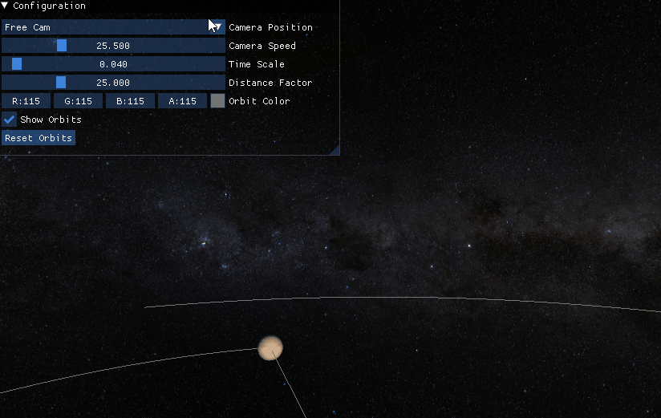
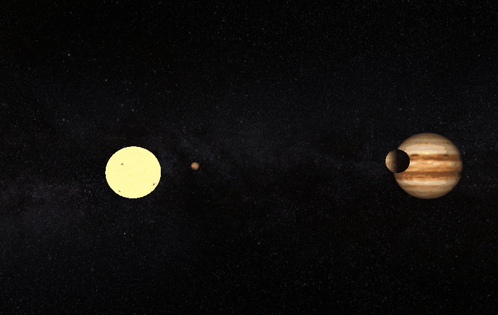

<p align="center">
  
</p>


 

## Motivation

Mess around with OpenGL and Dear ImGui and make a cool rendering project (def incomplete and needs reworking certain parts that I just got bored from working on)

## Features
### Uses Kepler's Equation to calculate orbital position
The orbital parameters should be pretty accurate (along with relative sizes and distances)

### Easy Configuration:
Properties of different celestial bodies can be configured easily using the config.json file (json handled using nlohmann json)

```
"Earth": {
  "orbitParameters": {
  "semiMajorAxis": 1.000,
  "eccentricity": 0.0167,
  "inclination": 0.000,
  "longitudeOfAscendingNode": -11.260,
  "argumentOfPeriapsis": 114.207
  },
  "scale": 1.000,
  "texture": "./resources/textures/earth.jpg",
  "position": {
  "x": -1.000,
  "y": 0.0,
  "z": 0.0
  }
},
```

### Debug Menu
Camera Speed, Attach Camera to Body, Change Orbit Color


### Light Effects
Basic light effects (ambient + diffuse)


### Skybox
Milky way skybox so it feels spacy (actual word btw)

